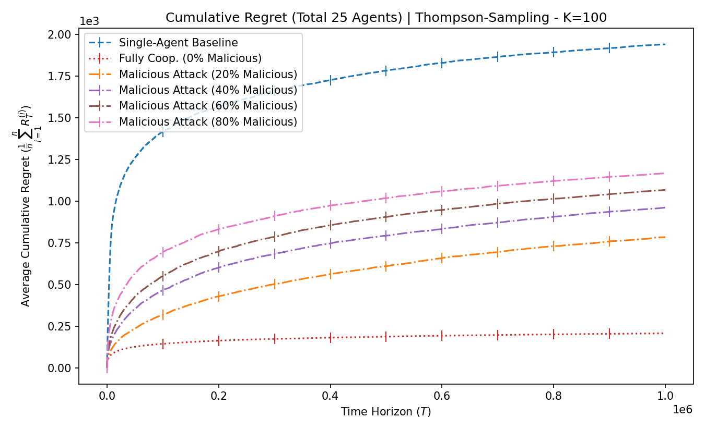
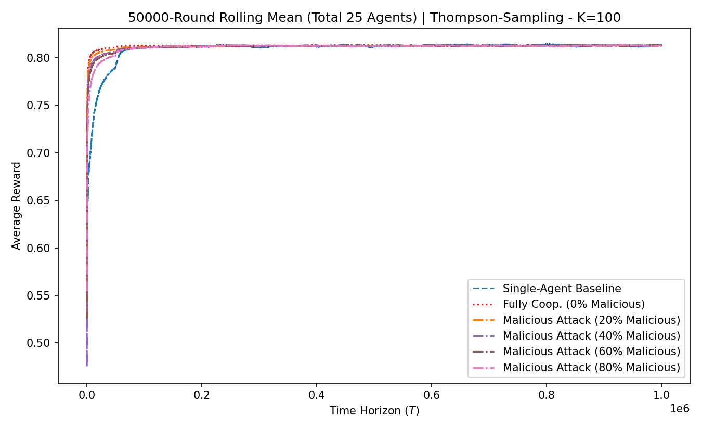

# Single-Agent vs Multi-Agent Multi-Armed Bandits Simulation

This project simulates and evaluates the vulnerabilities of collaborative Multi-Armed Bandit (MAB) algorithms using real-world data from the MovieLens 20M dataset. 

It compares a Single-Agent baseline against a Cooperative Multi-Agent network. To rigorously test the network's robustness against data poisoning, the total network size is kept strictly constant ($N_{total} = 25$), while the ratio of Honest to Malicious agents is dynamically shifted (from 0% up to 80% malicious).

The framework supports multiple algorithmic policies (`UCB`, `Epsilon-Greedy`, and `Thompson-Sampling`) and utilizes multiprocessing to run multiple attack scenarios concurrently.

---

## ⚙️ How to Run

### 1. Running the Main Simulation (`main_constant_total.py`)
To run the simulation, you can execute the Python file directly or use the provided batch/shell scripts (`run.bat` or `run.sh`). 

By default, the simulation maintains a strict total of **25 agents** and tests malicious scenarios at 0%, 20%, 40%, 60%, and 80% network toxicity.

| Argument | Short | Description | Default |
| :--- | :---: | :--- | :--- |
| `--data` | | Path to the MovieLens `ratings.csv` file | `data/ml-20m/ratings.csv` |
| `--k_arms` | `-k` | Number of movies (arms) to process | `1000` |
| `--t_horizon` | `-t` | Total time steps (Auto-calculates to $K \times 250$ if omitted) | *Auto* |
| `--policy` | | Bandit policy to use (`UCB`, `Epsilon-Greedy`, `Thompson-Sampling`) | `UCB` |
| `--explore_param` | | Exploration parameter (Alpha for UCB, Decay window for Epsilon) | *Auto* |
| `--beta` | | Phase duration scaling parameter | `2.0` |
| `--no_show` | | Saves the plots in the background without opening a window | *False* |

**Examples:**
*   **Run Thompson Sampling on a massive dataset in the background:**
    ```bash
    python main_constant_total.py -k 100000 -t 3500000 --policy Thompson-Sampling --no_show
    ```

*(Note: Data and plots are automatically saved to the `results/` folder with unique filenames like `mab_results_ConstantTotal_UCB_K8546_T3500000.npz` so previous runs are never overwritten).*

---

### 2. Redrawing Graphs (`utils/replot_constant.py`)
If you want to redraw your graphs, isolate specific lines, or magnify the convergence gaps using the intuitive zoom feature.

| Argument | Description |
| :--- | :--- |
| `--file` | The specific `.npz` file to load from the `results/` folder |
| `--single` | Flag to plot the Single-Agent Baseline |
| `--coop` | Flag to plot the Fully Cooperative Multi-Agent (0% Malicious) |
| `--malicious` | Flag to plot the Malicious Scenarios (20%, 40%, 60%, 80%) |
| `--zoom` | Intuitively zoom in on the end of the timeline (e.g., `80` fast-forwards past the first 80% of the graph and auto-scales the Y-axis to magnify the final 20%) |
| `--no_show`| Save the newly generated plots without popping up the window |

**Example:**
*   **Magnify the Malicious Damage (Exclude Single-Agent & Zoom in 80%):**
    ```bash
    python utils/replot_constant.py --file mab_results_ConstantTotal_UCB_K8546_T3500000.npz --coop --malicious --zoom 80
    ```

---

### 3. Comparing Policies Head-to-Head (`utils/compare_policies_constant.py`)
To definitively test which mathematical framework (UCB, Epsilon-Greedy, or Thompson Sampling) is the most robust, you can plot them against each other for a specific scenario. 

*(Note: You must first run `main_constant_total.py` for all three policies using the exact same parameters so the script has the data to compare!)*

| Argument | Description |
| :--- | :--- |
| `--suffix` | The shared end of the `.npz` filenames (e.g., `K8546_T3500000`) |
| `--target` | The specific scenario to compare: `single`, `coop`, or the exact $m$ value (e.g., `20` for 80% Malicious) |
| `--zoom` | Zoom in on the end of the timeline (e.g., `80` auto-scales to the final 20%) |
| `--no_show`| Save the newly generated plots without popping up the window |

**Examples:**
*   **Compare the 3 algorithms in a Perfect Cooperative Network:**
    ```bash
    python utils/compare_policies_constant.py --suffix K8546_T3500000 --target coop
    ```
*   **The Ultimate Stress Test (Compare under a Severe 80% Attack):**
    ```bash
    python utils/compare_policies_constant.py --suffix K8546_T3500000 --target 20 --zoom 80
    ```

---

### 4. Exporting to Excel (`utils/export_csv_constant.py`)
To convert the high-speed `.npz` binary data into a cleanly labeled `.csv` file (for viewing in Excel or other statistical software):

```bash
python utils/export_csv_constant.py --file mab_results_ConstantTotal_UCB_K8546_T3500000.npz
```
This will generate a matching .csv file right next to it in the results/ folder.

### Example Results


